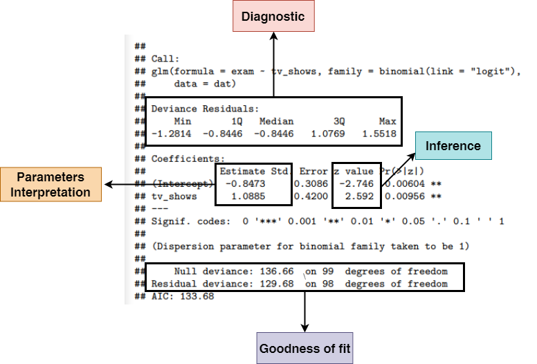
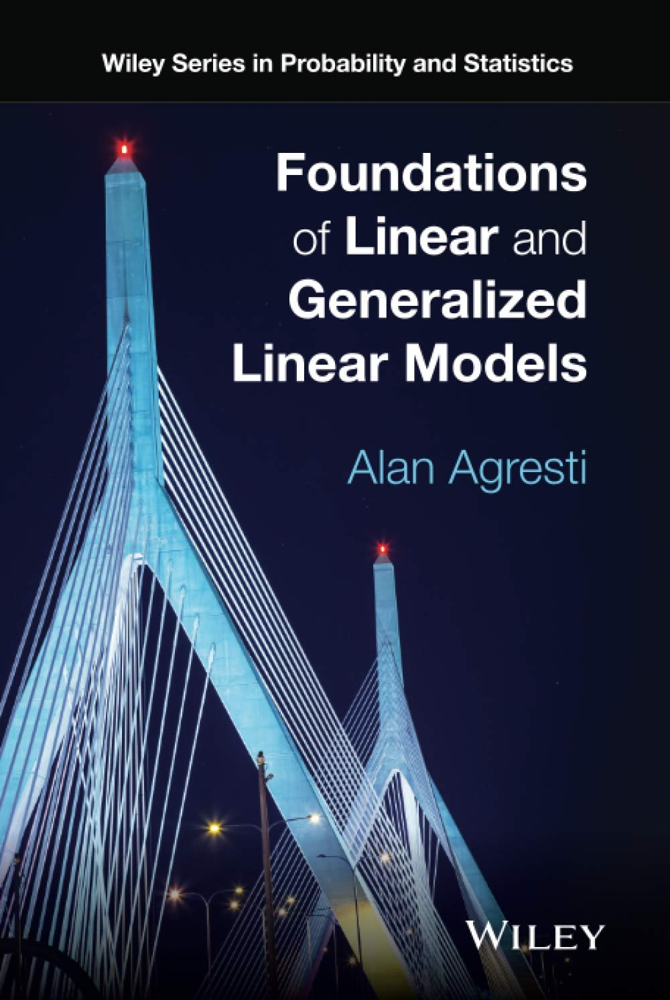
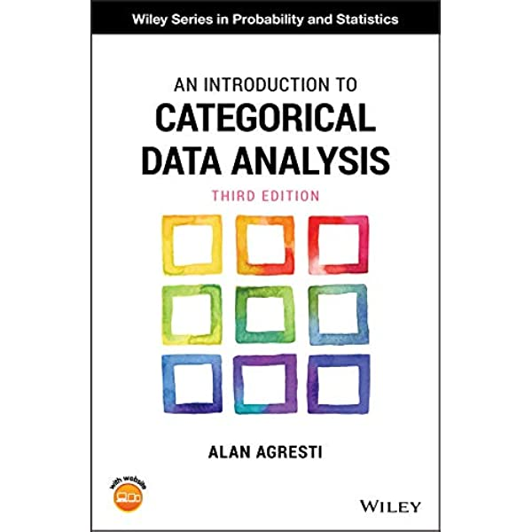
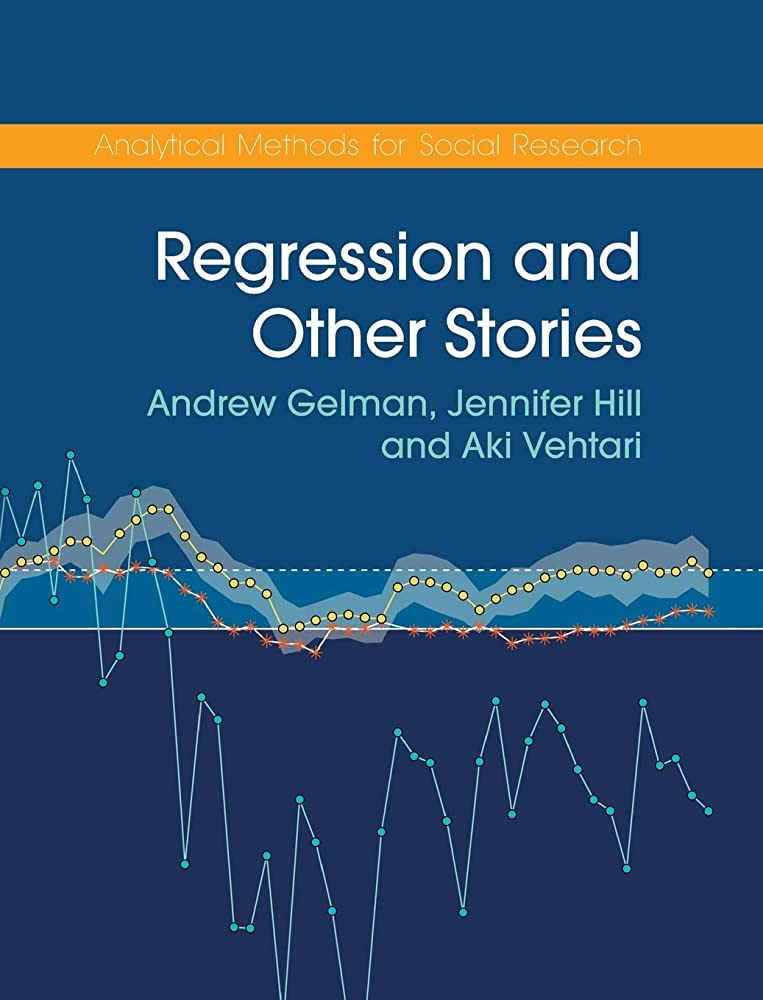
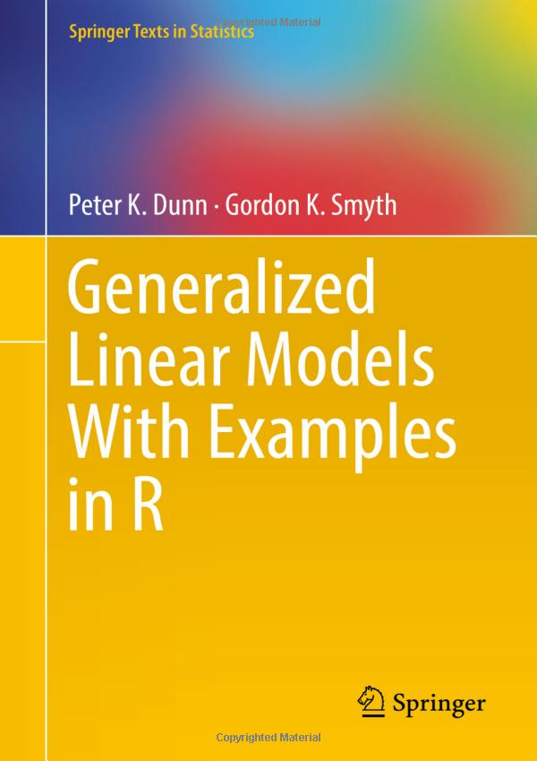
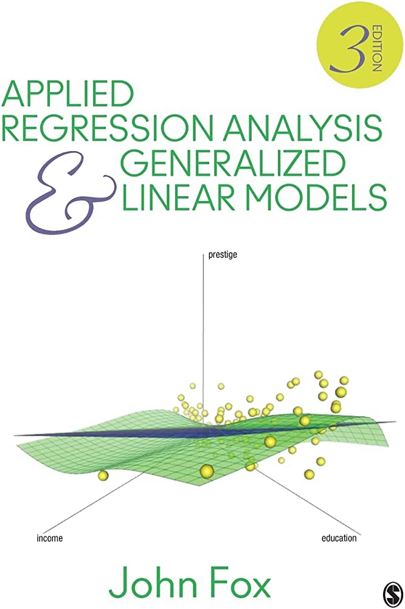
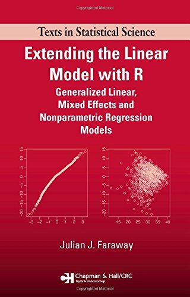

This material is largely taken from the one developed by Dr Filippo Gambarota, who kindly allowed me to take and reduce at my will. 
The original didactic material can be found here <https://github.com/stat-teaching/GLMphd>


```{r packages, include=FALSE}
knitr::opts_chunk$set(echo = FALSE,warning = FALSE,message = FALSE)
library(tidyverse)
library(kableExtra)
library(patchwork)
library(ggdist)
library(nortsTest)
library(filor)
```

```{r}
#| label: gt
#| include: false
qtab <- function(data, digits = 3){
  require(gt)
  data |> 
    gt::gt() |> 
    gt::cols_align(align = "center") |> 
    gt::tab_style(
      style = cell_text(weight = "bold"),
      locations = cells_column_labels()
    ) |> 
    gt::fmt_number(decimals = digits) |>
    gt::fmt_markdown()
}

oqtab <- function(data, digits = 3, ...){
  data |>
    kableExtra::kable(escape = FALSE,
                      format = "html") |>
    kableExtra::kable_styling(...)
}
```

# Beyond the Gaussian distribution {.section}

## Quick recap about Gaussian distribution

- The Gaussian distribution is part of the **Exponential family**
- It is defined with mean ($\mu$) and the standard deviation ($\sigma$)
- It is symmetric (mean, mode and median are the same)
- The support is $[- \infty, + \infty]$

. . .

The Probability Density Function (PDF) is:

$$
f(x, \mu, \sigma) = \frac{1}{\sigma\sqrt{2\pi}} e^{-\frac{1}{2}(\frac{x - \mu}{\sigma})^2}
$$

## Quick recap about Gaussian distribution

```{r, echo = FALSE}
ggnorm(0, 1)
```


```{r quick, echo = FALSE}
# ggnorm(c(0, 0, 1), c(1, 2, 0.5))
```

\begin{center}
But not always gaussian-like variables!
\end{center}

**But...**

In Psychology, variables do not always satisfy the properties of the Gaussian distribution. For example:

- Reaction times
- Percentages or proportions (e.g., task accuracy)
- Counts
- Likert scales
- ...

## Reaction times

Non-negative and probably skewed data:

```{r, echo = FALSE}
dat <- data.frame(
    x = rgamma(1e5, 9, scale = 0.5)*100
) 

dat |> 
    ggplot(aes(x = x)) +
    geom_histogram(fill = "dodgerblue",
                   color = "black") +
    xlab("Reaction Times (ms)") +
    ylab("Count")
```

## Binary outcomes

A series of binary (i.e., *bernoulli*) trials with two possible outcomes:

```{r, echo = FALSE}
dat <- data.frame(y = c(70, 30), x = c("Passed", "Failed"))

dat |> 
    ggplot(aes(x = x, y = y)) +
    geom_col(color = "black",
             fill = "dodgerblue") +
    ylab("%") +
    ylim(c(0, 100)) +
    theme(axis.title.x = element_blank()) +
    ggtitle("Statistics Final Exam (n = 100)")
```

## Counts

Number of symptoms for a group of patients during the last month:

```{r, echo = FALSE}
dat <- data.frame(x = rpois(1e5, 15))

dat |> 
    ggplot(aes(x = x)) +
    geom_bar(fill = "dodgerblue",
             color = "black") +
    scale_x_continuous(breaks = seq(0, 50, 5)) +
    xlab("Number of new patients during one month") +
    ylab("Count")
```

# Should we use a linear model for these variables? {.question}

<!-- ## Should we use a linear model for these variables? -->

Example: probability of passing the exam as a function of hours of study:

::: columns
:::: column
```{r, echo = FALSE}
# y = number of exercises solved in 1 semester
# x = percentage of attended lectures

n <- 50
x <- round(runif(n, 0, 100))
b0 <- 0.01
b1 <- 0.08
y <- rbinom(length(x), 1, plogis(qlogis(b0) + b1*x))

dat <- data.frame(id = 1:n, studyh = x, passed = y)

dat |> 
    filor::trim_df() |> 
    qtab()
```

::::
:::: column
```{r}
#| code-fold: false
dat |> 
  summarise(n = n(),
            npass = sum(passed),
            nfail = n - npass,
            ppass = npass / n)
```

::::
:::

<!-- ## Should we use a linear model for these variables? -->

Let's plot the data:

```{r, echo = FALSE}
exam_plot <- dat |>
  ggplot(aes(x = studyh, y = passed)) +
  geom_hline(yintercept = c(0, 1), linetype = "dashed", col = "firebrick") +
  geom_point(size = 3,
             alpha = 0.5,
             position = position_jitter(height = 0.03))
exam_plot
```

<!-- ## Should we use a linear model for these variables? -->

Let's fit a linear model `passing ~ study_hours` using `lm`:

```{r, echo = FALSE}
exam_plot +
    geom_smooth(method = "lm", se = F)
```


**Do you see something strange?**

<!-- ## Should we use a linear model for these variables? -->

A little **spoiler**, the relationship should be probably like this:

```{r, echo = FALSE}
exam_plot +
    stat_smooth(method = "glm", 
                se = FALSE,
                method.args = list(family = binomial))
```

<!-- ## Should we use a linear model for these variables? -->

Another example, the number of solved exercises in a semester as a function of the number of attended lectures ($N = 100$):

```{r, echo = FALSE}
# y = number of exercises solved in 1 semester
# x = percentage of attended lectures

n <- 100
x <- round(runif(n, 0, 63))
y <- rpois(n, exp(0 + 0.05*x))

dat <- data.frame(id = 1:n, nattended = x, nsolved = y)

dat |> 
    filor::trim_df() |> 
    qtab()
```

<!-- ## Should we use a linear model for these variables? -->

```{r echo = FALSE}
dat |> 
    ggplot(aes(x = nsolved)) +
    geom_bar()
```

<!-- ## Should we use a linear model for these variables? -->

```{r, echo = FALSE}
exam_plot <- dat |> 
    ggplot(aes(x = nattended, y = nsolved)) +
    geom_hline(yintercept = 0, linetype = "dashed", col = "firebrick") +
    geom_point(size = 3) +
    xlab("Number of attended lectures") +
    ylab("Solved exercises")
exam_plot
```

<!-- ## Should we use a linear model for these variables? -->

Again, fitting the linear model seems partially appropriate but there are some problems:

```{r, echo = FALSE}
fitp <- glm(nsolved ~ nattended, data = dat, family = poisson())
dat$p <- predict(fitp, type = "response")
dat$lower <- dat$p - sqrt(dat$p)
dat$upper <- dat$p + sqrt(dat$p)

exam_plot +
  geom_smooth(method = "lm", se = FALSE)
```

<!-- ## Should we use a linear model for these variables? -->

Again, fitting the linear model seems partially appropriate but there are some problems:

```{r, echo = FALSE}
exam_plot +
  geom_line(data = dat,
            aes(x = nattended, y = lower),
            lty = "dashed") +
  geom_line(data = dat,
            aes(x = nattended, y = upper),
            lty = "dashed")
```

<!-- ## Should we use a linear model for these variables? -->

Also the residuals are quite problematic:

```{r, echo = FALSE}
fit <- lm(nsolved ~ nattended, data = dat)

dfit <- data.frame(
    fitted = fitted(fit),
    residuals = residuals(fit)
)

qqn <- dfit |> 
    ggplot(aes(sample = residuals)) + 
    stat_qq() + 
    stat_qq_line() +
    xlab("Theoretical Quantiles") +
    ylab("Residuals")

res_fit <- dfit |> 
    ggplot(aes(x = fitted, y = residuals)) +
    geom_point() +
    ylab("Residuals") +
    xlab("Fitted") +
    geom_smooth(se = FALSE, color = "red")
qqn + res_fit
```

<!-- ## Should we use a linear model for these variables? -->

Another little spoiler, the model should consider both the support of the `y` variable and the non-linear pattern. Probably something like this:

```{r, echo = FALSE}
exam_plot +
    stat_smooth(method = "glm", 
                se = FALSE,
                method.args = list(family = poisson))
```

## So what?

Both linear models **somehow capture the expected relationship** but there are **serious fitting problems**:

- impossible predictions
- poor fitting for non-linear patterns
- linear regression assumptions not respected

## We need a new class of models...

- Taking into account the **specific features of our response variable**
- Working on a **linear scale** when fitting the model and for inference
- We need a model that is **closer to the true data generation process**

# Generalized Linear Model: an intuition 

## A different perspective on Linear Models: Modeling the mean

We usually assume:

$Y_i=\beta_0+\beta_1 X_i +\varepsilon_i$, with $\varepsilon_i\sim N(0,\,\sigma)$

A different, but equivalent perspective is:

$Y_i\sim N(\beta_0+\beta_1 X_i,\,\sigma)$

That is: we model the mean: $E(Y_i)=\beta_0+\beta_1 X_i$ with a linear model

```{r,echo=FALSE}
library(ggplot2)
library(MASS)

# Creiamo dei dati di esempio
set.seed(123)
df <- data.frame(  x = rnorm(1000))
df$y = 2 + 2 * df$x + rnorm(1000)


# Fit del modello lineare
model <- lm(y ~ x, data = df)

# Creiamo lo scatterplot di base con la linea di regressione
p <- ggplot(df, aes(x, y)) +
  geom_point(color="grey") +
  geom_smooth(method = "lm", se = FALSE, color = "red") +
  theme_minimal()

# Funzione per creare dati per la densità normale
normal_density <- function(x, y, sd, width = .5) {
  ys <- seq(y - 3*sd, y + 3*sd, length.out = 100)
  data.frame(
    x = x + dnorm(ys, mean = y, sd = sd) * width,
    y = ys
  )
}

# Selezioniamo alcuni punti x per le densità
x_points <- seq(min(df$x), max(df$x), length.out = 10)
y_pred <- predict(model, newdata = data.frame(x = x_points))
sd_residuals <- sd(residuals(model))

# Creiamo i dati per le densità
density_data <- do.call(rbind, lapply(1:length(x_points), function(i) {
  cbind(normal_density(x_points[i], y_pred[i], sd_residuals), group = i)
}))

# Aggiungiamo le densità normali al plot
p + geom_path(data = density_data, aes(x = x, y = y, group = group), linewidth = 1) +
    scale_color_discrete(name = "x value") +
    labs(x = "X", y = "Y")

```
  
## Example with dicotomous data: Passing the exam (Logistic Regression)


We want to measure the impact of **watching tv-shows** on the probability of **passing the statistics exam**.

- `exam`: **passing the exam** (1 = "passed", 0 = "failed")
- `studyh`: **hours of study** 


```{r, echo = FALSE}
n <- 1000
x <- round(runif(n, 0, 100))
b0 <- 0.01
b1 <- 0.08
y <- rbinom(length(x), 1, plogis(qlogis(b0) + b1*x))

dat <- data.frame(id = 1:n, studyh = x, passed = y)

# n <- 1000
# n_watching <- n/2 # just for simplicity
# p_pass_yes <- 0.7
# p_pass_no <- 0.3
# 
# dat <- data.frame(
#     tv_shows = rep(c(1, 0), each = n_watching)
# )
# 
# b0 <- 0.3 # P(passing|not watching)
# b1 <- 3.5 # odds ratio between watching and not watching

# pn_from_or(0.3, 3.5) # P(passing|watching)

# dat$exam <- rbinom(n, 1, plogis(qlogis(b0) + log(b1)*dat$tv_shows))
```

```{r, echo=FALSE}
# Simulated data
# set.seed(123)
# 
# x <- rnorm(1000)*1.3+5
# y <- rbinom(1000, 1, plogis(-10 + 2*x))
# D=data.frame(x, y)
# 
 dat$xc=round(dat$studyh/10,0)*10
# 
 Dc=data.frame(xc=sort(unique(dat$xc)),probs=prop.table(table(dat$xc,dat$passed),1)[,2])

# dat$xc=as.factor(dat$xc)

# Fit logistic regression
model <- glm(passed ~ studyh, data = dat, family = binomial(link = "logit"))


Dc$studyh=Dc$xc           
# Plot
ggplot(dat, aes(studyh, passed,colour = xc)) +
  geom_jitter(width=0,height=.03,size=1) +
  labs(title = "Logistic Regression Example")+
    geom_bar(data=Dc,aes(x=studyh,y=probs),stat="identity",alpha=.2)+theme_bw()+
  annotate("text", x=70, y=.80, label= "y~Bernulli(.70)\n E(y)=.70, Var(y)=.70*.30")+
  annotate("text", x=30, y=.3, label= "y~Bernulli(.20)\n E(y)=.20, Var(y)=.20*.80") +guides(
  colour =  FALSE )
```

### Linear model on transformed response

The linear model doesn't work here, we try to fit the linear model on a transformation of the mean $E(Y_i)=p_i$ ($p_i$ probability of success). 
As an example $g(E(Y_i))=g(p_i)=logit(p_i)=log(\frac{p_i}{1-p_i})$

We model the tranformed (logit()) mean of the binomial with a linear model:
$$log(\frac{p_i}{1-p_i})=\beta_0+\beta_1 X_i$$

```{r, echo=FALSE}
Dc$logit=qlogis(Dc$probs)
 

# Plot
ggplot(Dc, aes(studyh, logit,color=studyh)) +
  geom_point(size=5) + theme_bw()+
  # geom_smooth(method = "glm", method.args = list(family = "binomial"), se = FALSE) +
  labs(title = "Logistic Regression Example") +guides(
  colour =  FALSE )
```

# Generalized Linear Models  

## We need a new class of models...

- using distributions **beyond the Gaussian**
- modeling **non linear functions** on the response scale
- taking into account **mean-variance relationships**

## Recipe for a GLM

- **Random Component**
- **Systematic Component**
- **Link Function**

## Random Component

The **random component** of a GLM identify the response variable $y$ coming from a certain probability distribution.

```{r, echo = FALSE, out.width="50%"}
par(mfrow = c(1,3))

curve(dnorm(x), -4, 4, main = "Normal", ylab = "density(x)", cex.lab = 1.5, cex.main = 1.5)
plot(0:10, dbinom(0:10, 10, 0.5), type = "h", main = "Binomial", ylab = "density(x)",
     cex.lab = 1.5, cex.main = 1.5, xlab = "x")
points(0:10, dbinom(0:10, 10, 0.5), pch = 19)
plot(0:20, dpois(0:20, 8), type = "h", main = "Poisson", ylab = "density(x)",
     cex.lab = 1.5, cex.main = 1.5,
     xlab = "x")
```

## Systematic Component

The **systematic component** or *linear predictor* ($\eta$) of a GLM is:

$$
\eta_i = \beta_0 + \beta_1 x_{i1} + \beta_2 x_{i2} + \cdots + \beta_p x_{ip}
$$

This part is invariant to the type of model and is the combination of explanatory variables to predict the expected value $\mu$ (i.e. the mean) of the distribution.

## Link Function

The **link function** $g(\mu)$ is an **invertible** function that connects the mean $\mu$ of the random component with the *linear combination* of predictors.

$g(\mu) = \beta_0 + \beta_1x_{1i} + ... + \beta_px_{pi}$. The inverse of the link function $g^{-1}$ map the linear predictor ($\eta$) into the original scale.

$$
g(\mu_i) = \eta_i = \beta_0 + \beta_1 x_{i1} + \beta_2 x_{i2} + \cdots + \beta_p x_{ip}
$$

<!-- $$ -->
<!-- \mu_i = g(\eta_i)^{-1} = \eta_i = \beta_0 + \beta_1 x_{i1} + \beta_2 x_{i2} + \cdots + \beta_p x_{ip} -->
<!-- $$ -->

Thus, the relationship between $\mu$ and $\eta$ is linear only when the **link function ** is applied i.e. $g(\mu) = \eta$. 


The simplest **link function** is the **identity link** where $g(\mu) = \mu$ and correspond to the standard linear model. In fact, the linear regression is just a GLM with a **Gaussian random component** and the **identity** link function.

<!-- ```{r} -->
<!-- #| echo: false -->
<!-- #| tbl-cap: Main distributions and link functions -->
<!-- fam <- c("gaussian", "gamma", "binomial", "binomial", "poisson") -->
<!-- link <- c("identity", "log", "logit", "probit", "log") -->
<!-- range <- c("$$(-\\infty,+\\infty)$$", "$$(0,+\\infty)$$", -->
<!--            "$$\\frac{0, 1, ..., n_{i}}{n_{i}}$$", -->
<!--            "$$\\frac{0, 1, ..., n_{i}}{n_{i}}$$", -->
<!--            "$$0, 1, 2, ...$$") -->

<!-- linktab <- data.frame(Family = fam, Link = link, Range = range) -->
<!-- linktab$Family <- paste0("`",linktab$Family,"`") -->
<!-- linktab  -->
<!-- ``` -->

| Family       | Link     | Range                                              |
|--------------|----------|----------------------------------------------------|
| `gaussian`   | identity | $$(-\infty,+\infty)$$                              |
| `gamma`      | log      | $$(0,+\infty)$$                                    |
| `binomial`   | logit    | $$\frac{0, 1, ..., n_{i}}{n_{i}}$$                 |
| `binomial`   | probit   | $$\frac{0, 1, ..., n_{i}}{n_{i}}$$                 |
| `poisson`    | log      | $$0, 1, 2, ...$$                                   |


```{r packages2, include=FALSE}
#devtools::load_all()
library(tidyverse)
library(kableExtra)
library(patchwork)
library(ggeffects)
select <- dplyr::select
```

```{r}
#| label: gt2
#| include: false
qtab <- function(data, digits = 3){
  require(gt)
  data |> 
    gt::gt() |> 
    gt::cols_align(align = "center") |> 
    gt::tab_style(
      style = cell_text(weight = "bold"),
      locations = cells_column_labels()
    ) |> 
    gt::fmt_number(decimals = digits)
}
```

```{r functions, include = FALSE}
# funs <- filor::get_funs(here("R", "utils-glm.R"))
```


## Binomial GLM

- The **random component** of a Binomial GLM the binomial distribution with parameter $p$
- The **systematic component** is a linear combination of predictors and coefficients $\boldsymbol{\beta X}$
- The **link function** is a function that map probabilities into the $[-\infty, +\infty]$ range.

## Logit Link

The **logit** link is the most common link function when using a binomial GLM:

$$
log \left(\frac{p_i}{1 - p_i}\right) = \beta_0 + \beta_1x_{i1} + \beta_2x_{i2} + \cdots + \beta_px_{ip}
$$

The inverse of the **logit** maps again the probability into the $[0, 1]$ range:

$$
p = \frac{e^{\beta_0 + \beta_1x_{i1} + \beta_2x_{i2} + \cdots + \beta_px_{ip}}}{1 + e^{\beta_0 + \beta_1x_{i1} + \beta_2x_{i2} + \cdots + \beta_px_{ip}}}
$$

## Logit Link

Thus with a single numerical predictor $x$ the relationship between $x$ and $p$ in non-linear on the probability scale but linear on the logit scale.

```{r, echo = FALSE}
x <- seq(0, 1, 0.001)
p <- plogis(qlogis(0.01) + 8*x)

dat <- data.frame(x, p)
dat$lp <- log(odds(dat$p))

dat |> 
    pivot_longer(c(p, lp)) |> 
    mutate(name = factor(name, 
                         labels = c(latex2exp::TeX("$log(\\frac{p}{1-p})$"),
                                    latex2exp::TeX("$p$")))) |> 
    ggplot(aes(x = x*100, y = value)) +
    facet_wrap(~name, scales = "free",axes="all_y",
               labeller = label_parsed) +
    geom_line() +
    xlab(latex2exp::TeX("$X_1$")) +
    #ylab(latex2exp::TeX("$p$")) +

    theme(axis.title.y = element_blank())
```

## Logit Link

The problem is that effects are non-linear, thus is more difficult to interpret and report model results

```{r logitlink, eval=FALSE, echo = FALSE}
x <- runif(10000, 0, 1)
p <- plogis(qlogis(0.01) + 8*x)
linpred <- qlogis(p)
y <- rbinom(length(x), 1, p)

dat <- data.frame(
    y = y,
    x = x,
    p = p,
    lp = linpred
)

fp <- function(x) {
    qlogis(0.01) + 8 * x
}

pp <- c(0.5, 0.6, 0.7, 0.8)

plot_logit <- ggplot() +
    stat_function(data = data.frame(x = c(0,1)), 
                  aes(x),
                  fun = fp) +
    # points
    geom_point(aes(x = pp, y = fp(pp))) +
    geom_point(aes(x = c(0, 0, 0, 0), y = fp(pp))) + 
    geom_point(aes(x = pp, y = c(-5, -5, -5, -5))) +
    # segments
    geom_segment(aes(x = pp, y = c(-5, -5, -5, -5),
                     xend = pp, yend = fp(pp)),
                 linetype = "dashed",
                 linewidth = 0.3) +
    geom_segment(aes(x = pp, y = c(-5, -5, -5, -5),
                     xend = pp, yend = fp(pp)),
                 linetype = "dashed",
                 linewidth = 0.3) +
    geom_segment(aes(x = c(0,0,0,0), y = fp(pp),
                     xend = pp, yend = fp(pp)),
                 linetype = "dashed",
                 linewidth = 0.3) +
    xlab(latex2exp::TeX("$X_1$")) +
    ylab(latex2exp::TeX("$logit(p)$")) +
    theme(aspect.ratio=1)

plot_invlogit <- ggplot() +
    stat_function(data = data.frame(x = c(0,1)), 
                  aes(x),
                  fun = function(x) plogis(fp(x))) +
    # points
    geom_point(aes(x = pp, y = plogis(fp(pp)))) +
    geom_point(aes(x = pp, y = c(0, 0, 0, 0))) +
    geom_point(aes(x = c(0, 0, 0, 0), y = plogis(fp(pp)))) +
    # segments
    geom_segment(aes(x = pp, y = c(0, 0, 0, 0),
                     xend = pp, yend = plogis(fp(pp))),
                 linetype = "dashed",
                 linewidth = 0.3) +
    geom_segment(aes(x = pp, y = c(0, 0, 0, 0),
                     xend = pp, yend = plogis(fp(pp))),
                 linetype = "dashed",
                 linewidth = 0.3) +
    geom_segment(aes(x = c(0, 0, 0, 0), y = plogis(fp(pp)),
                     xend = pp, yend = plogis(fp(pp))),
                 linetype = "dashed",
                 linewidth = 0.3) +
    theme(aspect.ratio=1) +
    xlab(latex2exp::TeX("$X_1$")) +
    ylab(latex2exp::TeX("$logit^{-1}(p)$"))

plot_logit | plot_invlogit
```

## Model fitting in R

```{r, echo = FALSE}

```

## The big picture...

```{r, echo = FALSE}

```


## Main references

For a detailed introduction about GLMs

Chapters: 1 (intro), 4 (GLM fitting), 5 (GLM for binary data)

```{r, echo = FALSE, out.width="30%"}

```

## Main references

For a basic and well written introduction about GLM, especially the Binomial GLM

Chapters: 3 (intro GLMs), 4-5 (Binomial Logistic Regression)

```{r, echo = FALSE, out.width="50%"}

```

## Main references

Great resource for interpreting Binomial GLM parameters:

Chapters: 13-14 (Binomial Logistic GLM), 15 (Poisson and others GLMs)

```{r, echo = FALSE, out.width="30%"}

```

## Main references

Detailed GLMs book. Very useful especially for the diagnostic part:

Chapters: 8 (intro), 9 (Binomial GLM), 10 (Poisson GLM and overdispersion)

```{r, echo = FALSE, out.width="30%"}

```

## Main references

The holy book :)

Chapters: 14 and 15

```{r, echo = FALSE, out.width="30%"}

```

## Main references

Another good reference...

Chapters: 8

```{r, echo = FALSE, out.width="30%"}

```
